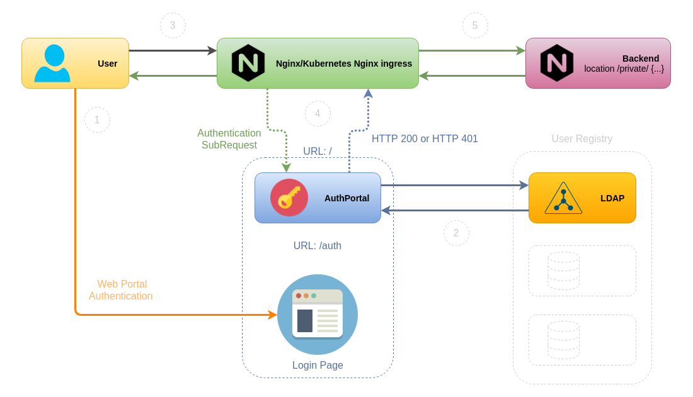

# AUTHPORTAL


[](https://opensource.org/licenses/Apache-2.0)

[](https://hub.docker.com/repository/docker/vfabi/authportal)


Users authentication web portal and authentication check endpoint for Nginx, Nginx Kubernetes ingress or HAProxy (haproxy-auth-request) with authorization based on the result of a subrequest. More details for Nginx you can find [here](https://docs.nginx.com/nginx/admin-guide/security-controls/configuring-subrequest-authentication/).  
You need to route all Nginx/Nginx ingress controller subrequests to AuthPortal root page to check if user authenticated, if not - route to AutPortal login page (/auth).  
AuthPortal returns one of 2 options based on user authentication state:  
- for non-authenticated users returns login page (if UNAUTHORIZED_ACTION=return_302), or returns HTTP/401 for Kubernetes ingress configuration (UNAUTHORIZED_ACTION=return_401)  
- for authenticated users returns HTTP/200  

User authentication is processing against one of the supported user registries. Supported user registries:  
* LDAPv3

## Diagram


## Features
- Authentication against LDAPv3 user registry backend.
- Simple captcha (no external dependencies to Google's reCaptcha and its configuration).
- User data caching. Decreases auth requests count to user registry backend.


# Technology stack
- Python 3.6+
- Flask - web framework
- ldap3 - for LDAP backend


# Requirements and dependencies
## Application
Python libs requirements in requirements.txt

## External
Configured and running one of the supported user registry backends.  

**LDAPv3**

Tested with openLDAP server only, but can be run with other LDAPv3 servers supported by `ldap3` python library (https://ldap3.readthedocs.io/en/latest/).  
For LDAP registry you need configured user entry in RDN specified in `LDAP_SERVER_SEARCH_RDN` env variable. For example `LDAP_SERVER_SEARCH_RDN='ou=Users,dc=example,dc=com'` and user entry with `objectclass=inetOrgPerson` and `cn` (for username) attributes, these attributes used as user searching filter.  


# Configuration
## Environment variables
| Name | Required | Values | Default | Description |
|----------|:-------------:|------:|------:|------:|
|LOGGING_LEVEL|False|INFO,DEBUG|INFO|Logging level|
|UNAUTHORIZED_ACTION|False|return_302, return_401|return_401|Action for unauthenticated user, return_302 - redirect to login page, return_401 - just returns HTTP/401|
|REDIRECT_URL_PARAM_NAME|False|any string|rd|Url param name what contains redirection url for successfully authenticated user.'rd' - for Kubernetes|
|HTML_FORM_HEADER|False|any string|Authentication Portal|User login form header at login page|
|USER_CACHE_TIMEOUT|False|any integer|10|User data cache timeout in minutes|
|AUTH_BACKEND|False|ldap,mock|ldap|User registry backend type|
|LDAP_SERVER_USER_DN|if AUTH_BACKEND=ldap|||LDAP server admin user DN. Example: cn=admin,dc=example,dc=com|
|LDAP_SERVER_PASSWORD|if AUTH_BACKEND=ldap|||LDAP server admin user password|
|LDAP_SERVER_SEARCH_RDN|if AUTH_BACKEND=ldap|||LDAP server RDN for authentication user search. Example: ou=Users,dc=example,dc=com|
|LDAP_SERVER_ADDRESS|if AUTH_BACKEND=ldap|||LDAP server address|
|LDAP_SERVER_PORT|False||389|LDAP server port|
|LDAP_SERVER_USE_SSL|False|False,True|False|Use SSL for LDAP server connection|


# Usage
## Usage in Kubernetes (Nginx ingress)
1. Change ConfigMap values to yours and apply Kubernetes configuration example:  
```
---
apiVersion: v1
kind: ConfigMap
metadata:
  name: authportal
  namespace: dev
data:
  UNAUTHORIZED_ACTION: return_401
  REDIRECT_URL_PARAM_NAME: rd
  HTML_FORM_HEADER: Edge Authentication Portal
  AUTH_BACKEND: ldap
  LDAP_SERVER_USER_DN: 'cn=admin,dc=example,dc=com'
  LDAP_SERVER_PASSWORD: dasdYa78jKal
  LDAP_SERVER_SEARCH_RDN: 'ou=Users,dc=example,dc=com'
  LDAP_SERVER_ADDRESS: 101.101.79.208
  LDAP_SERVER_PORT: '389'

---
apiVersion: apps/v1
kind: Deployment
metadata:
  name: authportal
  namespace: dev
  labels:
    app: authportal
spec:
  replicas: 1
  selector:
    matchLabels:
      app: authportal
  template:
    metadata:
      labels:
        app: authportal
    spec:
      containers:
        - image: vfabi/authportal:latest
          name: authportal
          imagePullPolicy: Always
          ports:
            - name: http
              containerPort: 8000
          envFrom:
          - configMapRef:
              name: authportal

---
apiVersion: v1
kind: Service
metadata:
  name: authportal
  namespace: dev
spec:
  selector:
    app: authportal
  ports:
    - name: authportal
      port: 80
      protocol: TCP
      targetPort: 8000
```

2. Update your Nginx ingress configuration:
```
nginx.ingress.kubernetes.io/auth-signin: https://frontend.example.com/auth
nginx.ingress.kubernetes.io/auth-url: http://authportal.dev.svc.cluster.local

location /auth {
    proxy_set_header Host $host;
    proxy_pass http://authportal.dev.svc.cluster.local/auth;
}
```

## Docker-compose stack (for testing only)
To run openLDAP + PHPldapadmin + AuthPortal stack use /deploy/examples/docker-compose.yaml.


# Docker
[](https://hub.docker.com/repository/docker/vfabi/authportal)  


# Contributing
Please refer to each project's style and contribution guidelines for submitting patches and additions. In general, we follow the "fork-and-pull" Git workflow.

 1. **Fork** the repo on GitHub
 2. **Clone** the project to your own machine
 3. **Commit** changes to your own branch
 4. **Push** your work back up to your fork
 5. Submit a **Pull request** so that we can review your changes

NOTE: Be sure to merge the latest from "upstream" before making a pull request!


# License
Apache 2.0
